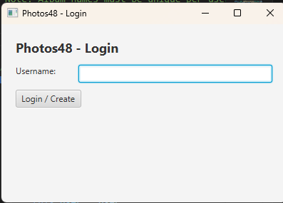
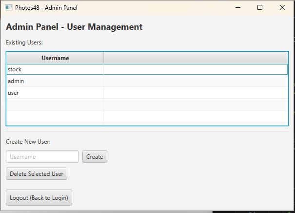

# Photos48

**Author:** Esmeralda Bencosme

A full-featured JavaFX desktop application for photo management with album organization, tagging, search capabilities, and multi-user support. Built with Maven on JDK 21 and JavaFX 21.

## 📋 Overview

Photos48 is a desktop photo management system that allows users to:
- Organize photos into albums with captions and custom tags
- Import photos with background processing and automatic thumbnail generation
- Search photos by date range or tag combinations (AND/OR logic)
- View photos with interactive zoom controls
- Manage multiple user accounts with isolated workspaces
- Utilize an admin panel for user management

## ✨ Key Features

### Photo Management
- **Album Organization**: Create, rename, and delete albums; photos can exist in multiple albums
- **Smart Import**: Background import with progress tracking and optional copy-to-workspace
- **Thumbnail Cache**: Automatic thumbnail generation with disk caching and invalidation on source updates
- **Photo Metadata**: Captions, tags with custom types, and automatic date/time extraction from file timestamps

### Search & Discovery
- **Date Range Search**: Find photos within specific date ranges (inclusive)
- **Tag Search**: Search by single tag or combine multiple tags with AND/OR logic
- **Case-Insensitive**: All tag searches are case-insensitive for better usability
- **Quick Navigation**: Double-click search results to open photos directly in the viewer

### User Experience
- **Multi-User Support**: Each user has isolated photo storage and album collections
- **Admin Panel**: Create and delete user accounts (accessible via `admin` login)
- **Stock Demo User**: Pre-configured `stock` user with sample images for immediate testing
- **Interactive Viewer**: Zoom in/out with buttons or slider, edit captions and tags on the fly

### Technical Features
- **Persistent Storage**: Java serialization-based data persistence in user home directory
- **Thumbnail Optimization**: Cached thumbnails regenerate only when source files change
- **Graceful Cleanup**: Deleted imported photos moved to `.trash` folder, not permanently removed
- **Cross-Platform**: Works on Windows, macOS, and Linux

## 🖼️ Application Screenshots

### Login Screen
The application starts with a simple login interface. Enter a username to create a new account or access an existing one.



### User Home - Album List
View all your albums with photo counts and date ranges. Create, rename, or delete albums from this screen.


### Album View - Photo Grid
Browse photos in a grid layout with thumbnails. Add, remove, or organize photos with intuitive controls.


### Photo Viewer
View full-size photos with zoom controls, edit captions, manage tags, and navigate between photos.


### Search Interface
Search photos by date range or tag combinations. Results display with photo details and can be opened directly.

#### Search by Date Range


#### Search by Tags


### Admin Panel
Manage user accounts, create new users, or remove existing ones. Accessible by logging in with username `admin`.



## 🚀 Getting Started

### Prerequisites
- **JDK 21** or higher
- **Maven 3.9+**

### Installation & Running

1. **Clone or download** the project to your local machine

2. **Navigate** to the project root directory:
   ```powershell
   cd Photos48
   ```

3. **Run the application**:
   ```powershell
   mvn -DskipTests javafx:run
   ```

4. **Build executable JAR** (optional):
   ```powershell
   mvn -DskipTests package
   ```
   Output: `target/Photos48-1.0-SNAPSHOT.jar`

5. **Generate Javadoc** (optional):
   ```powershell
   mvn -DskipTests verify
   ```
   Output: `./docs/index.html`

## 📖 Usage Guide

### First Launch

1. **Launch the application**: `mvn -DskipTests javafx:run`

2. **Choose a login option**:
   - **`stock`** - Explore a pre-configured demo account with sample images from `./data`
   - **Any new username** - Create a fresh account with empty album collection
   - **`admin`** - Access admin panel to create/delete user accounts

### Working with Albums

1. From the **User Home** screen, click **Add Album** to create a new album
2. Select an album to view its photos
3. Use **Rename** or **Delete** to manage albums

### Importing Photos

1. Open an album
2. Click **Add Photo** and select image files (jpg, jpeg, png, bmp, gif)
3. A progress dialog shows background import and copy status
4. Thumbnails are automatically generated and cached

### Viewing and Editing Photos

1. Click a photo thumbnail to open the viewer
2. Use **Zoom In/Out** buttons or slider to adjust view
3. Edit the **caption** in the text area
4. **Add tags**: Select tag type from dropdown, enter value, click Add
5. **Delete tags**: Select tag in list, click Delete Tag

### Searching Photos

1. Click **Search** from the User Home screen
2. **Date Range Search**: Select from/to dates, click Search
3. **Tag Search**: 
   - Single tag: Enter one tag value
   - Multiple tags: Enter two tags, select AND or OR mode
4. Double-click results to open photos in viewer

### Testing with Stock Images

The stock user includes sample photos dated **July 23, 2025**:
- Login as `stock`
- Open the "stock" album
- To test search: Use date range 07/23/2025 to 07/23/2025

## 📁 Project Structure

```
Photos48/
├── src/main/java/photos48/
│   ├── model/           # Data models (User, Album, Photo, Tag, TagType)
│   ├── persistence/     # Data storage (ObjectDataStore, UsersIndex)
│   ├── service/         # Business logic (Album, Photo, Search, Tag, User services)
│   └── ui/              # JavaFX UI (Photos main, SceneManager, controllers)
├── src/main/resources/fxml/  # FXML layout files
├── data/                # Stock user sample images (12 sample JPEGs included)
├── docs/                # Generated Javadoc
├── target/              # Maven build output
├── pom.xml              # Maven configuration
└── README.md            # This file
```

## 💾 Data Storage

- **User Data**: `~/.photos48/` (Windows: `C:\Users\<username>\.photos48\`)
  - `users.ser` - List of all usernames
  - `user_<username>.ser` - Per-user data (albums, photos, tags)
- **Thumbnails**: `~/.photos48/.thumbnails/user_<username>/`
- **Trash**: `~/.photos48/.trash/user_<username>/` (deleted imported photos)
- **Stock Images**: `./data/` (source images for stock user initialization)

## 🛠️ Technical Details

### Architecture
- **Model-View-Controller (MVC)**: Clear separation of concerns
- **Service Layer**: Business logic isolated from UI controllers
- **Persistence Layer**: Java serialization with DataStore interface

### Technologies
- **JavaFX 21**: Modern desktop UI framework
- **Maven**: Dependency management and build automation
- **Java Serialization**: Simple persistence with versioned compatibility

### Main Class
- Entry point: `photos48.ui.Photos`

## 📝 Notes

- Photos can appear in multiple albums simultaneously (reference-based)
- Imported photos are optionally copied to user workspace for portability
- Thumbnails automatically regenerate when source files are modified
- Admin account cannot be deleted to prevent lockout
- All tag searches are case-insensitive for better user experience

## 📄 License

This project is developed as an academic assignment.

---

**Photos48** - Simple, elegant photo management for desktop.
